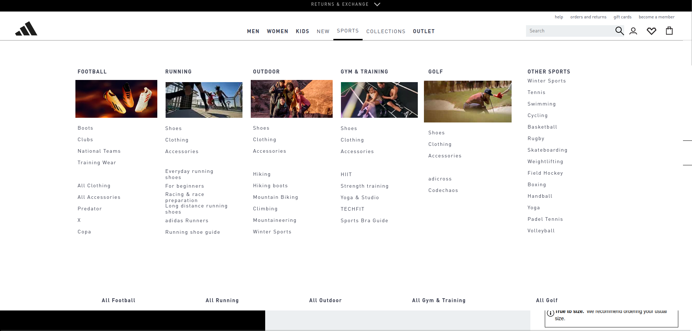

# AdidasFEC

[Video Tour](./client/public/readmeAssets/adidas_site_recording_compressed.mp4)

## Team Requirements

Build a single page application (the item detail page). The components will be linked together on a main layout, and all components must coordinate and work together to present content for a given item ID or item name.

## Individual Requirements

Each project should:

- Be responsible for managing presentation and state for one module
- Look like the original site's module in terms of HTML+CSS presentation
- Have its own database and webserver for delivering that module's content to the user
- Contain realistic and representational data for a given Item ID or item name.
- Be embeddable on a page next to other modules

## Frameworks and Libraries Used

- Node.js
- PostgreSQL
- Docker
- React.js
- Express.js
- Vite

## Installation

- Run npm install
- Create a .env file
- Connect to the Docker container

Use the following code to get started:

- npm init -y
- npm install dotenv pg express swiper cors

## Environment Variables

To run this project, you will need to add the following environment variables to your .env file

`DATABASE_URL=postgres://<db-user>:<db-password>@<db-host>/adidas`

`PORT=<server-port>`

## Usage

Run the Docker container 1st

To start the API server, run the following command:

- nodemon server.js
  Nodemons will start the server on the port specified in the .env file.

To start the client, run the following command:

- npm run dev
  This will open a Vite port for the front end.

## Deployment

Open the local host provided by Vite.

## Screenshots

